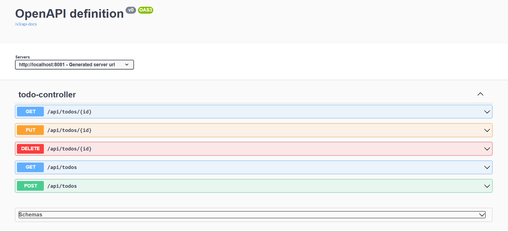

# 📝 Spring Boot Todo App

A simple and clean **REST API-based Todo application** built using **Spring Boot** and **PostgreSQL**. This project demonstrates CRUD operations, database integration, and API design — making it a great backend starter project.

---

## 🚀 Features

* ✅ Create a Todo
* 📋 Fetch all Todos
* 🔍 Get Todo by ID
* ✏️ Update Todo
* ❌ Delete Todo
* 💾 Persistent storage using PostgreSQL
* 🌐 RESTful API design

---

## 🛠️ Tech Stack

* **Java 17**
* **Spring Boot**
* **Spring Data JPA (Hibernate)**
* **PostgreSQL**
* **Maven**

---

## 📂 Project Structure

```
com.example.todo
│
├── controller     → REST APIs
├── model          → Entity (Todo)
├── repository     → JPA Repository
└── TodoApplication.java
```

---

## ⚙️ Setup & Run Locally

### 1️⃣ Clone the repository

```
git clone https://github.com/your-username/springboot-todo-app.git
cd springboot-todo-app
```

---

### 2️⃣ Configure Database

Update `application.properties`:

```
spring.datasource.url=jdbc:postgresql://localhost:5432/todo_db
spring.datasource.username=your_username
spring.datasource.password=your_password
```

---

### 3️⃣ Run the application

```
mvn clean spring-boot:run
```

---

### 4️⃣ Access API

```
http://localhost:8081/api/todos
```

---

## 📌 API Endpoints

| Method | Endpoint          | Description     |
| ------ | ----------------- | --------------- |
| GET    | `/api/todos`      | Get all todos   |
| GET    | `/api/todos/{id}` | Get todo by ID  |
| POST   | `/api/todos`      | Create new todo |
| PUT    | `/api/todos/{id}` | Update todo     |
| DELETE | `/api/todos/{id}` | Delete todo     |

---

## 🧪 Sample Request

### ➕ Create Todo

```
POST /api/todos
```

```json
{
  "title": "Learn Spring Boot"
}
```

---

##📘 API Documentation (Swagger UI)

This project uses Swagger UI for interactive API documentation.
👉 Access Swagger UI after running the application:
http://localhost:8081/swagger-ui/index.html

#🔍 Features
- View all available API endpoints
- Test APIs directly from the browser
- Send request bodies (JSON)
- View real-time responses
- No need for external tools like Postman

📸 Example
You can:
* Create a new Todo
* Fetch all Todos
* Update or delete tasks
- All directly from Swagger UI 🎯

## 📷 Swagger UI Preview



## 📸 Future Improvements

* Add Service Layer (clean architecture)
* Add DTOs for better API design
* Input validation (`@Valid`)
* Swagger API documentation
* Authentication (JWT)
* Docker support
* Deployment on cloud (Render / Railway)

---

## 🎯 Purpose of this Project

This project was built to:

* Understand Spring Boot fundamentals
* Practice REST API development
* Learn database integration using JPA/Hibernate
* Prepare for backend & QA automation roles

---

## 👩‍💻 Author

**Shreya Badarkhe**

---

## ⭐ If you like this project

Give it a ⭐ on GitHub and feel free to fork it!
